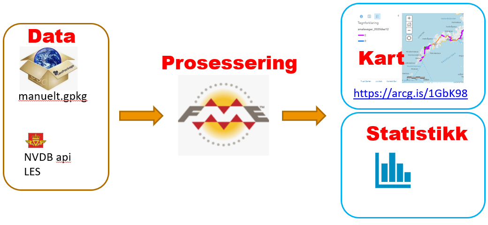

# Estimat, statlige veger (Europa- og riksveger) uten gul midtstripe

Gul midtstripe har vi kun der vegen er bred nok, 6.5 meter eller bredere. 

Hvis data om vegene våre var perfekt og komplett registrert i Nasjonal vegdatabank kunne vi tatt alle 
"klassiske" 2-feltsveger (ikke såkalt "kanalisert veg") der det _ikke_ finnes 
registrert data om midtstripe, 
midtrekkverk eller midtdeler. 

Dessverre har vi mye veger der vi våre data om den fysiske tilstanden på vegoppmerking og andre ting er mangelfulle. 

Det nest beste er å lage et estimat hvor vi gjør det beste ut av de dataene vi har og kvalitetssikrer dette manuelt 
så godt vi kan - innen den tiden 
og med den arbeidskraften vi har til rådighet. 

> Ideelt sett bør vi også bygge en løype der man ikke trenger gjenta all manuell 
kvalitetssikring hver gang man oppdaterer analysen. En slik kvalitetssikring bør kunne gjenbrukes og utvides. på en god og gjenbrukbar måte.

### Datagrunnlag

Vi henter følgende datatyper fra Nasjonal Vegdatabank (NVDB)

  * Vegoppmerking langsgående (objekttype 99) med bruksområde = midtlinje, dvs gulstripe. 
  * Rekkverk (objekttype 5) med bruksområde = Midtdeler eller Midtrekkverk
  * Vegbredde: Vi har flere objekttyper som beskriver vegbredde i NVDB 
    - Vegbredde (583)
    - Statistikk vegbredde (647)
    - Vegbredde, beregnet (838)
  * Vegnett - såkalt [segmentert vegnett](https://nvdbapiles-v3.atlas.vegvesen.no/dokumentasjon/openapi/#/Vegnett/get_vegnett_veglenkesekvenser), dvs veglenker som har informasjon om vegnummer. 

Vi henter selvsagt kun data langs europa- og riksveger, dvs med filteret _vegsystemreferanse=Ev,Rv_. 

# Dataflyt

  * **HENT DATA** Vi leser data fra NVDB (python + geopandas, `hentnvdbdata.py`)
  * **AUTOMATISERT PROSESSFLYT MED ITERATIV MANUELL KVALITETSFORBEDRING** Etter litt eksperimentering fant jeg fram til en god, iterativ arbeidsprosess der automatisk prosessering (FME) gradvis blir forsterket med manuelt opprettede kartlag som overstyrer automatikken i de områdene der den åpenbart feiler (pga mangelfullt datagrunnlag). 
    * Kjør FME-prosessen `vegbredder.fmw` 
        * Vi tar vegnettsdata og klipper vekk de bitene av vegnettet som overlapper med midtrekkverk, midtdeler og gulstripe. 
      * Vi tar vegbreddedata som er 6 meter eller smalere og "tagger" de veglenkebitene som overlapper med dem. 
    * Sjekk data visuelt i kartverktøy (Qgis). Ser du suspekte strekninger så sjekker du med [vegbilder](https://vegbilder.atlas.vegvesen.no/), [vegkart](http://vegkart.no) og evt andre kilder. 
    * Falske positive: Legg til en flate i kartlaget `manuell.gpkg/eksluder`
    * Falske negative, eller kun flekkvise treff der det sansynligvis er en lengre strekning uten midtstripe: Legg til en flate i kartlaget `manuell.gpkg/inkluder` 
    * Gjenta inntil du er fornøyd med resultatet fra FME-rutina
    * Fordelen med denne måten å jobbe på er at de manuelle vurderingene blir gjenbrukbare og etterprøvbare, samtidig som vi har en automatisert dataproduksjon. 
* **PUBLISER** 
  * Konverter til fil-geodatabase (.gdb, med FME) og publiser til https://arcg.is/1GbK98 _(fem enkle klikk via Arcgis Pro)_.  
  * Trekk ut statistikk med python pandas _(bruk groupby-funksjon, summer lengde per fylke evt per kommune)_

Eksempel på en bit av E16 med falske positive, ekskludert med en flate i kartlaget `manuell.gpkg/eksluder`, manuelt opprettet med Qgis.

Eksempel på bit av E16 der det er _(eller iallfall var, per desember 2020)_ en lengre sammenhengende strekning uten gulstripe, men vi fikk kun noen flekkvise treff i FME analyserutina. Via manuelt opprettede flater i `manuell.gpkg/inkluder` kan vi overstyre slik at hele strekningen blir med i resultatene.  

Vegbilde eksempel, viser overgangen mellom gulstripe og ingen midtstripe på E16 ved Jevnaker, juni 2020.

# Svar på spørsmål nr 665 til skriftlig besvarelse fra stortingsrepresentant Siv Mossleth til samferdselsminister Knut Arild Hareide

## Spørsmål

Hvor mange kilometer statlig vei mangler gulstripe i dette landet, og hvor ligger disse veistrekningene uten gulstripe?

## Svar 

Statens vegvesen har estimert hvor det mangler gul midtlinje på statlig veg, det vil si Europa- og riksveg. Estimatene med plassering på kart er presentert på følgende nettadresse: https://www.arcgis.com/home/webmap/viewer.html?webmap=16f94c252aac4fdf93ff8da503e c6385. Disse strekningene markert i kartet.

Totalt er det estimert 1 030 km statlig veg uten gul midtlinje, fordelt på 551 km Europaveg og 479 km riksveger. Disse fordeler seg fylkesvis som vist i tabellen under. De kommunene som har høyest antall km uten gul midtlinje er Karasjok med 126 km, Ullensvang med 81 km og Tana med 77 km.

| Fylke	| Fylkesnavn	| Km  | lengde |
|-------|-------------|-----|--------|
| 54 | Troms og Finnmark    | 435 |
| 46 | Vestland             | 227 |
| 18 | Nordland             | 151 |
| 42 | Agder                |  62 |
| 38 | Vestfold og Telemark |  58 |
| 11 | Rogaland             |  40 |
| 50 | Trøndelag            |  22 |
| 15 | Møre og Romsdal      |  21 |
| 34 | Innlandet            |  10 |
| 30 | Viken                |   6 |

[Skriftlig svar fra samferdselsministeren](./SVAR_Siv_Mossleth_samferdselsminister_1993021.pdf)
