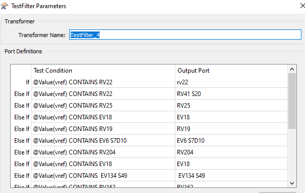

# Estimat, statlige veger (Europa- og riksveger) uten gul midtstripe

Gul midtstripe har vi kun der vegen er bred nok, 6.5 meter eller bredere. 

Hvis data om vegene våre var perfekt og komplett registrert i Nasjonal vegdatabank kunne vi tatt alle 
"klassiske" 2-feltsveger (ikke såkalt "kanalisert veg") der det _ikke_ finnes 
registrert data om midtstripe, 
midtrekkverk eller midtdeler. 

Dessverre har vi mye veger der vi mangler oppdaterte data om den fysiske tilstanden på vegoppmerking og andre ting. 

Det nest beste er å lage et estimat hvor vi gjør det beste ut av de dataene vi har og kvalitetssikrer dette manuelt 
så godt vi kan - innen den tiden 
og med den arbeidskraften vi har til rådighet. 

_Ideelt sett bør vi også bygge en løype der man ikke trenger gjenta all manuell 
kvalitetssikring hver gang man oppdaterer analysen. En slik kvalitetssikring bør kunne gjenbrukes og utvides. på en god og gjenbrukbar måte.

### Datagrunnlag

Vi henter følgende datatyper fra Nasjonal Vegdatabank (NVDB)

  * Vegoppmerking (objekttype 5) med bruksområde = midtlinje
  * Rekkverk (objekttype 5) med bruksområde = Midtdeler eller Midtrekkverk
  * Vegbredde: Vi har flere objekttyper som beskriver vegbredde i NVDB 
    - Vegbredde (583)
    - Statistikk vegbredde (647)
    - Vegbredde, beregnet 838

# Bilder TODO

lag bildeeksemper Ev16 vest for Gardermoen

